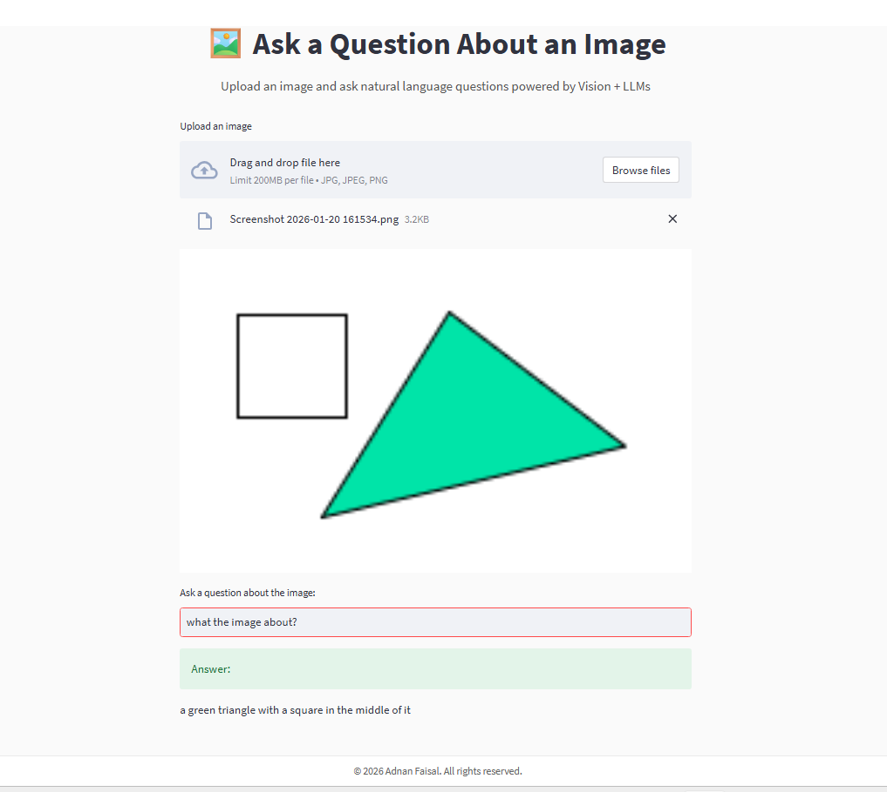

# 🖼️ Vision-LLM Image Question Answering System

An interactive **multimodal AI web application** that allows users to upload an image and ask natural-language questions about it.  
The system integrates **computer vision models** with **large language models (LLMs)** to analyze visual content and generate meaningful, human-like responses.

---

## 📸 Demo Screenshot

Below is an example of the application in action:




---

## 🚀 Project Overview

This project demonstrates how **visual understanding** and **language reasoning** can be combined into a single intelligent system.  
Users upload an image, ask a question, and receive an AI-generated response based on deep visual analysis and contextual reasoning.

The entire system is implemented as a **web application** using Streamlit, making it interactive, user-friendly, and easy to run locally.

---

## ✨ Key Features

- 📤 Upload images in **JPG / JPEG / PNG** format  
- 🧠 Automatic image understanding using deep learning  
- 🗨️ Ask **natural-language questions** about the image  
- 🔍 Object detection and image captioning  
- 🤖 Reasoned responses generated by an LLM-powered agent  
- 🎨 Custom-styled, clean user interface  
- 🔐 Secure API key handling using environment variables  

---

## 🧠 System Architecture

The application follows a **modular and layered architecture**:

### 1️⃣ Image Processing Layer
- Image captioning using **BLIP**
- Object detection using **DETR**
- Safe temporary image handling (Windows-compatible)

### 2️⃣ Reasoning Layer
- Custom tools exposed to a **LangChain conversational agent**
- Multi-turn conversational memory
- LLM-based reasoning over visual observations

### 3️⃣ Application Layer
- Interactive UI built with **Streamlit**
- Custom HTML/CSS styling
- Input validation and response rendering

---

## 🛠️ Technologies Used

- **Python 3.10**
- **Streamlit** – Web application framework
- **LangChain** – Agent and tool orchestration
- **OpenAI GPT-3.5-Turbo** – Language reasoning
- **Hugging Face Transformers**
  - BLIP (Image Captioning)
  - DETR (Object Detection)
- **PyTorch**
- **Pillow (PIL)** – Image processing
- **HTML / CSS** – UI customization

---

## ⚙️ Installation & Setup

### 1️⃣ Clone the Repository
```bash
git clone https://github.com/your-username/vision-llm-image-qa.git
cd vision-llm-image-qa

🧪 How to Use

Upload an image (JPG / JPEG / PNG).

Preview the uploaded image in the interface.

Enter a natural-language question such as:

“What objects are in the image?”

“Describe the image.”

Receive an AI-generated answer based on visual understanding and reasoning.

🧩 Project Structure
vision-llm-image-qa/
│
├── app.py              # Main Streamlit application
├── tools.py            # LangChain custom tools
├── vision_utils.py     # Computer vision utilities
├── requirements.txt    # Python dependencies
├── assets/             # Images and screenshots
├── notebooks/          # Experiments and tests
└── README.md

🧠 Skills Demonstrated

Multimodal AI system design

Computer vision model integration

LLM-based reasoning with LangChain

Secure API key management using environment variables

Windows-specific debugging and file handling

Modular and maintainable Python architecture

Streamlit-based UI development

End-to-end AI application deployment

🔮 Future Enhancements

Bounding-box visualization on images

Confidence scores for detected objects

Support for multiple image inputs

Video-based question answering

Cloud deployment (Docker / Hugging Face Spaces)

👤 Author

Adnan Faisal

📧 Email: ajfaisal1208023@gmail.com

📄 License

This project is licensed under the MIT License.

⭐ Final Note

This project was designed, implemented, debugged, and deployed end-to-end as a complete AI system, demonstrating practical skills in computer vision, large language models, and modern AI application development.

